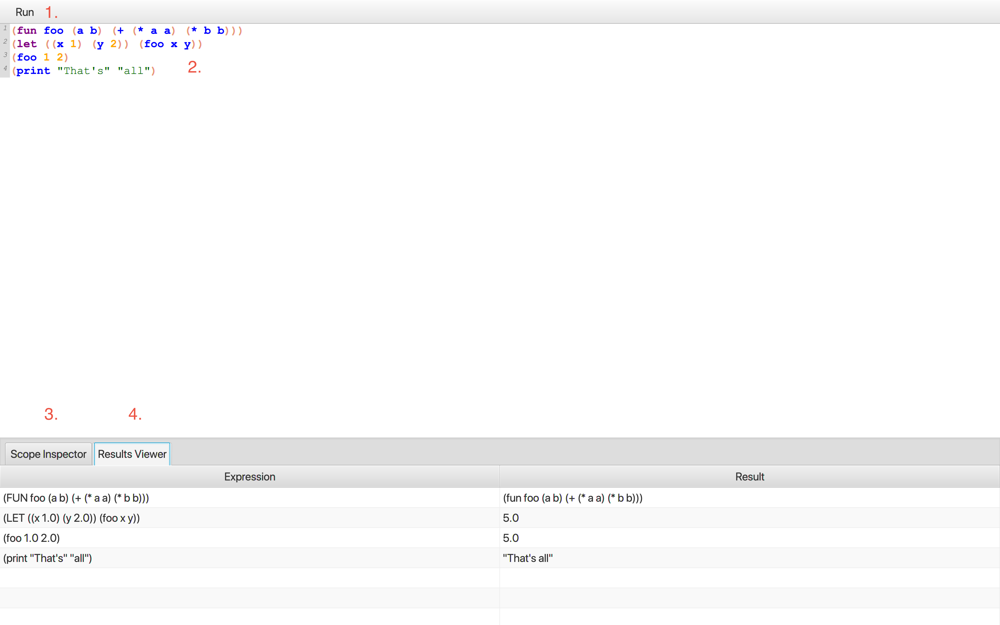
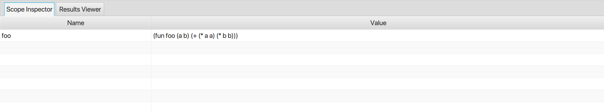
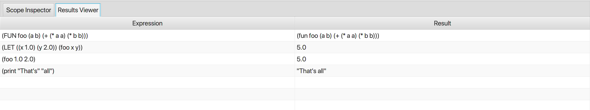

# Overview
KLisp is a simple Lisp-like language. The point of this language is for me to learn Kotlin, Gradle, IntelliJ IDEA, and 
show off some of my skills. One of my favorite projects for learning, since I love programming languages, is a language.
For example, here's [huskel](https://github.com/john-patterson/huskel), [lispjs](https://github.com/john-patterson/lispjs),
and [passcal](https://github.com/john-patterson/passcal).

I suggest you also read [LEARNINGS.md](LEARNINGS.md) to see the issues I ran into, how I pivoted, and what I picked up
fom the experience. This is, after all, the point of this code.

There are three major parts to this project. The first is, of course, the language itself in the
[compiler module](https://github.com/john-patterson/KLispIDE/tree/master/compiler). The IDE that I wrote for interacting
with my language is in the [editor module](https://github.com/john-patterson/KLispIDE/tree/master/editor). The IDE
never directly uses the language runtime (though it does use some types from the module), but instead all calls for
syntax highlighting and code execution go through a server that runs out of the editor process in the
[server module](https://github.com/john-patterson/KLispIDE/tree/master/editor).

## Requirements
This project uses JDK version 14.0.2 and targets the 1.8 JVM version. This was developed and tested primarily under
Mac OS X 10.15.6, but has also run on Windows 10.

## Running the Editor
Clone this code and entire the root of the project directory in two different terminal sessions. You will need one to
launch the language server and another to launch the editor itself.
* On OS X:
  - `./gradlew :server:run`
  - `./gradlew :editor:run`
* On Windows:
  - `gradlew.bat :server:run`
  - `gradlew.bat :editor:run`
  
Traffic uses TDP port 7340. The editor is also hard-coded to hit localhost at the moment.
  
## Language Overview
I will focus on the features and description of the language. For implementation details, check out the
[language architecture documentation](compiler/ARCHITECTURE.md).

### Data Types

* __booleans__: This is true and false, represented by the reserved keywords `true` and `false`.
* __numbers__: All numbers are floating-point and are expressible in their usual manner (1, 0, 0.0, -2.434, etc).
* __strings__: Strings start and end with `"` and cannot contain a double quote.
  - Example: `"Hello World!"`
* __lists__: Lists are created using square brackets `[]`.
  - Example: `[a b]` or `[1 a "foo" [1 2 3]]`
* __expressions__: Everything else. Expressions start with a symbol or expression which evaluates to a function. The rest of the
body is passed as arguments to that function at interpretation time.
   - Example: `(function 1 2 3)`

### Special Language Constructs

* __let__: Let-binding is used to bind values to symbols within the scope of the body.
  - Example: `(let ((a 1) (b 2)) (+ a b))`
* __fun__: This creates a named function, defines it in the current scope, and returns the function itself. There are
Three parts to a function: the name, the parameter list, and the body.
  - Example: `(fun foo (a b) (+ a b))`
  
  Functions which take no parameter are expressed by either omitting the parameter list, for instance:
  - Example: `(fun bar true)`
  
  Or by using the empty list as the parameter list:
  - Example: `(fun bar [] true)`
  
* __if__: If expected 3 values: (1) a boolean expression, (2) a value to return if (1) is true,
and (3) a value to return if (1) is false.
  - Example: `(if true "true" "false")`

 
 ### Predefined-Functions
 These are all functions which are built into the language runtime and cannot be redefined.
 * __+__: Addition
   - Example: `(+ 1 2 3 4 5) => 15` 
 * __-__: Subtraction
   - Example: `(- 10 5 2) => 3` 
 * __/__: Division
   - Example: `(/ 30 15 2) => 1` 
 * __*__: Multiplication
   - Example: `(* 1 2) => 2` 
 * __and__: Logical and 
   - Example: `(and true false true) => false` 
 * __or__: Logical or
   - Example: `(or true false true) => true` 
 * __eq__: Deep equality operator
   - Example: `(eq [1 2] [1 2]) => true` 
 * __neq__: Deep inequality operator
   - Example: `(neq [1 2] [1 3]) => true` 
 * __car__: Returns the head of a list
   - Example: `(car [1 2 3]) => 1` 
 * __cdr__: Returns the tail of a list
   - Example: `(cdr [1 2 3]) => [2 3]` 
 * __cons__: Appends an item to a list
   - Example: `(cons [] 1) => [1]` 
 * __print__: Writes the value given to the console output and evaluates to the passed string.
   - Example: `(print "foo") => foo`
   
   If multiple strings are passed, they are joined by spaces in between and printed and returned as such.
   - Example: `(print "Hello" "world") => "Hello world"`
   
## Editor Overview
I owe a lot to the [TornadoFX](https://tornadofx.io) framework and the [RichTextFX](https://github.com/FXMisc/RichTextFX)
library. Most of the work I did here was learning how to shovel bits into these appropriately.

You can learn more in the [editor architecture documentation](editor/ARCHITECTURE.md).

Here you can see a screenshot of the editor:

Here are the highlighted parts:
 1. The Run menu. This is where you can execute the code from the code area. Simply press `Run` > `Run entire file`.
 2. The code area. This where you author your code. Note the syntax highlighting and line numbers.
 3. The Scope Inspector tab.
 4. The Results Viewer tab.

### The Scope Inspector

The Scope Inspector lets you see the state of the global program scope on the execution of the last line of code.
Currently, only the `fun` construct can modify this scope.

### The Results Viewer

The Results Viewer shows the result of evaluating each individual expression that is evaluated as your
program runs. This only shows expressions that are not sub-expressions.

In other words:
  `(foo 1 (bar a b))`
  
Would show `(foo 1 (bar a b))`, but not `(bar a b)`.
  